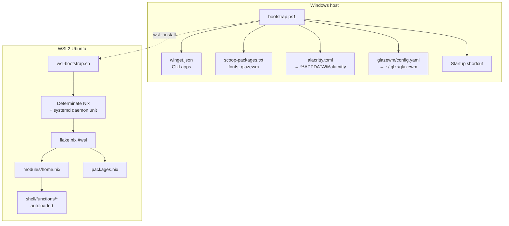

# nix-windows-config

Windows counterpart to [`nix-darwin-config`](https://github.com/blarer/nix-darwin-config).
A hybrid setup: the dev environment is reproduced exactly via Nix inside WSL2,
while the desktop layer runs natively on Windows.

- **WSL2 Ubuntu + home-manager** — shell, CLI tools, editor, dev env, ported
  1:1 from the Darwin modules and filtered to drop macOS-only dependencies.
- **Windows host** — Alacritty (terminal), GlazeWM (tiling WM with built-in
  hotkeys), GUI apps via winget/scoop.



## Quick start

Two commands, one per side. Both are idempotent, so re-running is safe.

**1. Windows** (elevated PowerShell):

```powershell
cd C:\Users\blare\nix-windows-config\windows
Set-ExecutionPolicy -Scope Process Bypass -Force
.\bootstrap.ps1
```

Installs winget/scoop apps and fonts, deploys the Alacritty and GlazeWM
configs, registers GlazeWM autostart, and installs WSL2 + Ubuntu if absent.

**2. WSL** (inside Ubuntu, after creating your user):

```bash
bash /mnt/c/Users/blare/nix-windows-config/windows/wsl-bootstrap.sh
```

Installs Determinate Nix, registers the `nix-daemon` systemd unit, clones this
repo to `~/nix-windows-config`, activates the home-manager generation, and runs
the smoke test.

See [`windows/WSL2.md`](windows/WSL2.md) for prerequisites and troubleshooting.

## Verify

Both sides ship a smoke test that exits non-zero on failure.

```powershell
powershell -NoProfile -File windows\smoketest-windows.ps1   # Windows side
```

```bash
just smoke      # WSL side (or: zsh windows/smoketest.zsh)
```

The Windows test checks the GlazeWM process, config drift against the repo
copy, autostart shortcut, absence of the old komorebi/whkd, Alacritty and its
config, the `alt+enter` binding target, and the winget/scoop inventory. The WSL
test checks binaries, autoloaded functions, aliases, git config, and Helix LSPs.

On Windows, where `nix` is unavailable, two checks run without a build:

```powershell
powershell -NoProfile -File tools\check-nix-syntax.ps1   # structure + line endings
powershell -NoProfile -File tools\check-readme.ps1       # docs match reality
```

The first validates Nix files structurally (brace/string balance), enforces the
autoload contract, and checks line endings in both directions. The second
verifies that every path, `just` recipe, and keybinding named in this README
actually exists.

## Layout

| Path | Purpose |
|---|---|
| `flake.nix` | home-manager flake: `homeConfigurations.wsl`, `devShells`, `formatter`, `checks` |
| `flake.lock` | Pinned inputs. Committed, so builds are reproducible |
| `packages.nix` | Linux-filtered package set |
| `treefmt.nix` | `nix fmt` config (nixfmt + taplo) |
| `Justfile` | switch / build / check / gc / smoke recipes |
| `modules/home.nix` | zsh, starship, helix, git, gh, delta, btop, atuin, … |
| `modules/shell/functions/` | Autoloaded zsh function bodies, one file per function |
| `tools/check-nix-syntax.ps1` | Windows-runnable structural + line-ending check |
| `tools/check-readme.ps1` | Verifies this README still matches the repo |
| `windows/bootstrap.ps1` | Windows installer (winget + scoop + configs + WSL2) |
| `windows/wsl-bootstrap.sh` | WSL installer (Nix + daemon + clone + switch + smoke) |
| `windows/winget.json` | GUI app manifest |
| `windows/scoop-packages.txt` | Fonts, glazewm, Windows-native fallbacks |
| `windows/glazewm/config.yaml` | Tiling WM + hotkeys → `~/.glzr/glazewm/` |
| `windows/alacritty/alacritty.toml` | Terminal config → `%APPDATA%\alacritty\` |
| `windows/smoketest-windows.ps1` | Windows-side verification |
| `windows/smoketest.zsh` | WSL-side verification |
| `windows/WSL2.md` | WSL setup detail and troubleshooting |
| `windows/NOTES.md` | What was dropped from the macOS config, and why |

## Daily use

From inside WSL, in the repo:

```bash
just switch        # build, show diff, confirm, activate
just switch-fast   # build and activate
just dry-run       # build and diff without activating
just check         # fmt-check + lint + deadnix + flake check
just smoke         # re-run the smoke test
just update        # update flake inputs, then switch
just gc            # collect garbage older than 14 days
just               # list everything
```

## Window manager

GlazeWM tiles *and* owns its hotkeys, so there is no separate hotkey daemon.

| Binding | Action |
|---|---|
| `Alt+H/J/K/L` | Focus left/down/up/right |
| `Alt+Shift+H/J/K/L` | Move window |
| `Alt+1..9` | Switch workspace |
| `Alt+Shift+1..9` | Move window to workspace |
| `Alt+R` | Resize mode (then `hjkl`, `escape` to exit) |
| `Alt+V` | Toggle tiling direction |
| `Alt+F` / `Alt+M` | Fullscreen / minimize |
| `Alt+Shift+Space` | Toggle floating |
| `Alt+Enter` | Launch Alacritty |
| `Alt+Shift+Q` | Close window |
| `Alt+Shift+R` | Reload config |
| `Alt+Shift+E` | Exit GlazeWM |

`Alt+Space` is deliberately left free for PowerToys Run; cycle-focus lives on
`Alt+G`.

The config is tracked at `windows/glazewm/config.yaml` and deployed to
`~/.glzr/glazewm/config.yaml`. After editing the live file, press
`Alt+Shift+R` to reload, then copy it back into the repo. The smoke test
compares the two and fails on drift.

## Shell functions

Function bodies live one-per-file in `modules/shell/functions/` and are lazily
`autoload`ed from `~/.config/zsh/functions`, mirroring the Darwin config. To
add one:

1. Create `modules/shell/functions/<name>` containing the **body only**, with
   no `function name() { ... }` wrapper. That is the autoload convention.
2. Add `<name>` to the `autoload -Uz` list in `modules/home.nix`.

`tools/check-nix-syntax.ps1` fails if the two ever disagree in either
direction.

## Gotchas

These are all real failures hit while building this repo, each now guarded by a
test.

- **`~/.gitconfig` shadows the managed git config.** Git reads it before
  `~/.config/git/config`, so if it exists, every home-manager git setting is
  inert. `git config --global` creates it. Fix: `rm ~/.gitconfig`.
- **CRLF breaks WSL scripts.** zsh reads the trailing `\r` as part of the last
  token. `.gitattributes` pins `*.sh`/`*.zsh`/`*.nix`/function bodies to LF and
  `*.ps1` to CRLF; the checker verifies both.
- **The Nix daemon may not start on WSL.** The installer can finish leaving
  `cannot connect to socket`. `wsl-bootstrap.sh` registers a systemd unit with
  `Type=simple`, because `determinate-nixd` never sends an `sd_notify`
  readiness signal and `Type=notify` therefore hangs until it times out.
- **`wsl --list --quiet` exits 0 with empty output** when WSL is installed but
  has no distributions, so checking only the exit code wrongly reports success.

## Relationship to nix-darwin-config

The WSL side is a port of the Darwin config. When pulling improvements across,
note that upstream splits packages into `packages/*.nix` and shell config into
`modules/shell.nix`, whereas this repo keeps a single `packages.nix` and a
single `modules/home.nix` because the Windows port needs a smaller subset.

macOS-only functions (`ocvis`, `tor-toggle`, `llm`) are deliberately not
ported. See `windows/NOTES.md` for the full list of dropped applications and
their Windows replacements.

## Fidelity

| Capability | macOS | Windows port | Fidelity |
|---|---|---|---|
| Shell, CLI tools, editor, Python/git workflow | nix-darwin | WSL2 + Nix | 100% |
| Terminal | WezTerm | Alacritty (ported theme + keys) | 90% |
| Tiling WM | AeroSpace | GlazeWM | 90% |
| GUI apps | brew cask | winget / scoop | 80% |
| System defaults, Touch ID, launchd | native | partial / manual | ~40% |
